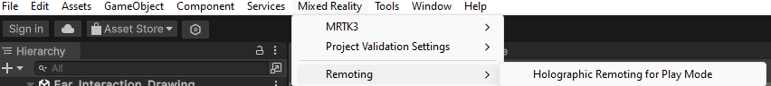
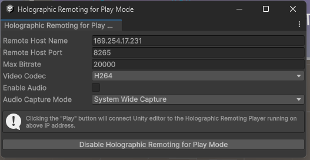

# HandTracking
Handtracking for MRTK

install newtonsoft: com.unity.nuget.newtonsoft-json

# Holographic Remoting with Unity and HoloLens 2

This guide provides step-by-step instructions on how to set up and use holographic remoting with Unity and HoloLens 2.

## Step 1: Enable Holographic Remoting

1. **Install Holographic Remoting App on HoloLens 2**
   - Go to the Microsoft Store on your HoloLens 2.
   - Search for `Holographic Remoting Player` and install the app.

## Step 2: Connect Unity to HoloLens 2

1. **Start Holographic Remoting on HoloLens 2**
   - Open the `Holographic Remoting Player` app on your HoloLens 2.
   - Note the IP address displayed on the app.

2. **Connect from Unity**
   - In Unity, open the `Mixed Reality > Remoting > Holographic Remoting for Play Mode` window.

   
   

   - In the `Remote Host Name` enter the IP address from your HoloLens 2.
   - In the `Video Codec` select Auto or H264.
   - Click `Enable Holographic Remoting for Play Mode`.
   
      
3. **Play Your Scene**
   - Once connected, press `Play` in Unity to start the remoting session.
   - Your Unity scene should now stream to your HoloLens 2 device in real-time.

## Troubleshooting

- **Connection Issues**: Ensure both your PC and HoloLens 2 are on the same network.
- **Unable to Establish Connection**: If a connection through the network cannot be established and alternative is:
   - Connect the HoloLens device to your PC with a cable.
   - Turn off the Wi-Fi on the HoloLens.
   - Enter in Unity the new IP address that is displayed on the Hololens.

## Additional Resources

- [Holographic Remoting Documentation](https://learn.microsoft.com/en-us/windows/mixed-reality/develop/unity/preview-and-debug-your-app?tabs=openxr)

